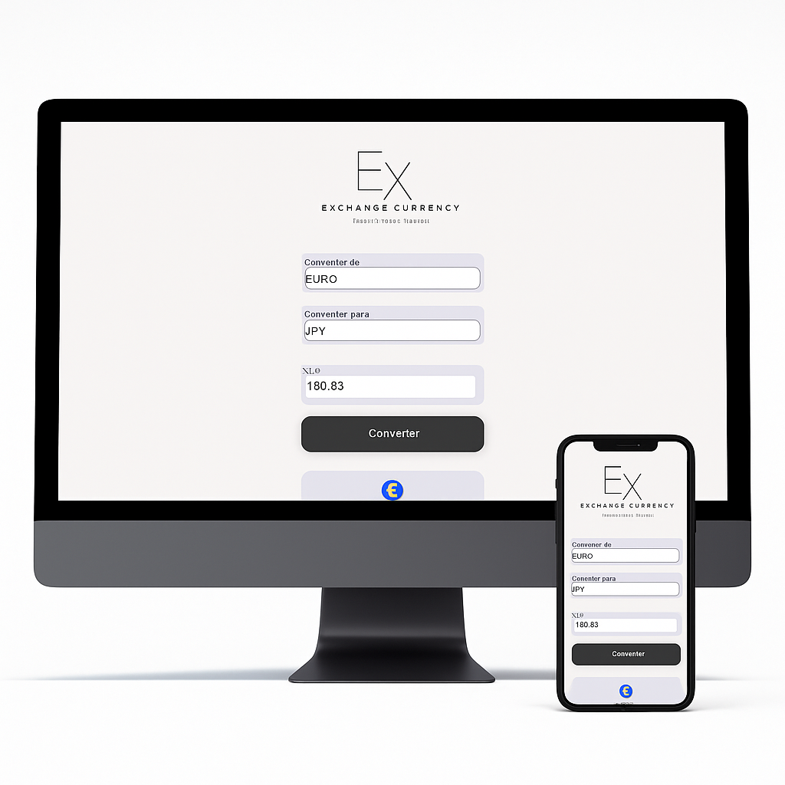

# EX | Exchange Currency 

Uma aplicação web responsiva para conversão de moedas internacionais desenvolvido na DevClub como desafio, com uma interface minimalista e moderna. Ideal para quem deseja converter valores de forma rápida e visualmente agradável.

---

## Funcionalidades

 Conversão entre diversas moedas
- Seleção de moeda de origem e destino (ex: EUR → JPY)
- Valores exibidos com formatação internacional
- Interface totalmente responsiva
- Exibição de ícones de moeda e bandeiras

---

##  Tecnologias Utilizadas

- HTML5
- CSS3
- JavaScript
- `Intl.NumberFormat` (formatação monetária)
- Layout com Flexbox

---

## Preview

### Versão Desktop e Mobile:

  

